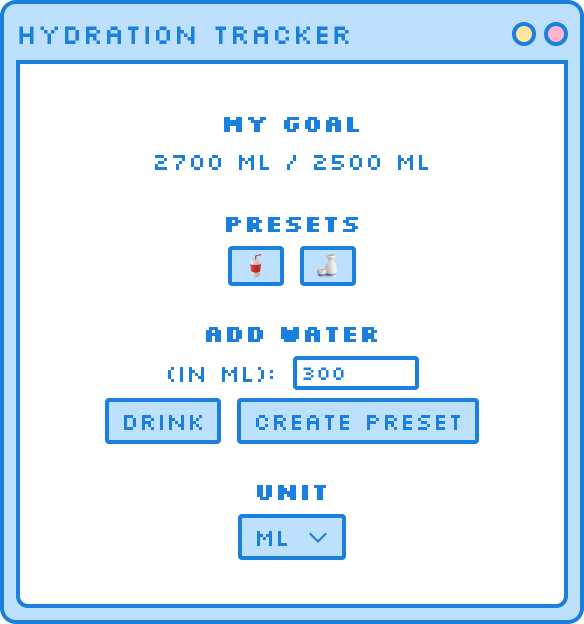

<h1 align="center">💧 Hydration Tracker</h1>


## Table of Contents

- [📑 About](#📑-about)
- [🎨 Layout](#🎨-layout)
- [✨ Features](#✨-features)
- [🛠️ Planned Features](#🛠️-planned-features)
- [📚 What I Learned](#📚-what-i-learned)
- [🤔 How To Use](#🤔-how-to-use)

## 📑 About

Hydration Tracker is a desktop application built with Electron designed to make water consumption tracking both simple and enjoyable.

Drinking the necessary amount of water everyday is crucial for maintaining overall health and preventing various health issues, so this tool was made to help the user remember to stay hydrated and have fun while at it.

## 🎨 Layout

<div align="center">



</div>

Check out the complete design on [Figma](https://www.figma.com/design/RyQPo0xTzMynER7AYqlirG/Hydration-Tracker---Design?node-id=0-1&t=PMJ6f3fUdbdzZlAO-1).

## ✨ Features

- **🎯 Customizable Goals** - Set your daily water intake target
- **⚡ Custom Presets** - Save and use frequently consumed amounts
- **🌓 Multiple Themes** - Light, dark, and darker mode support
- **🔢 Flexible Units** - Switch between mL, L, fl oz and cups
- **🔄 Daily Reset** - Automatically resets goals every day

## 🛠️ Planned Features

- **🔔 Reminders** - Get notified to drink water
- **🗓️ Calendar** - Track which days you achieved your daily intake target
- **🎨 More Themes** - The more the merrier

## 📚 What I Learned

This project was a lot of fun to develop. As my first electron app, I learned quite a load of things about the different processes (main, preload and renderer) and how to build desktop apps for multiple platforms. This was also my first try at a "cuter" more pastel UI, which I personally think turned out great.

It was a joy finally using Svelte in a bigger project and having the opportunity to familiarize myself with its concepts, like the $derived rune, which I had not previously used.

## 🤔 How To Use

- Clone this repository:

```bash
git clone https://github.com/Luhmeiy/hydration-tracker hydration-tracker
cd hydration-tracker
```

- Install dependencies:

```bash
npm install
```

### For development

- Run the app:

```bash
npm run dev
```

### For production

- Build the app (Choose your OS):

```bash
npm run build:win
npm run build:mac
npm run build:linux
```

---

<div align="center">

[](https://github.com/Luhmeiy)
[](https://www.linkedin.com/in/luhmeiy/)

</div>
